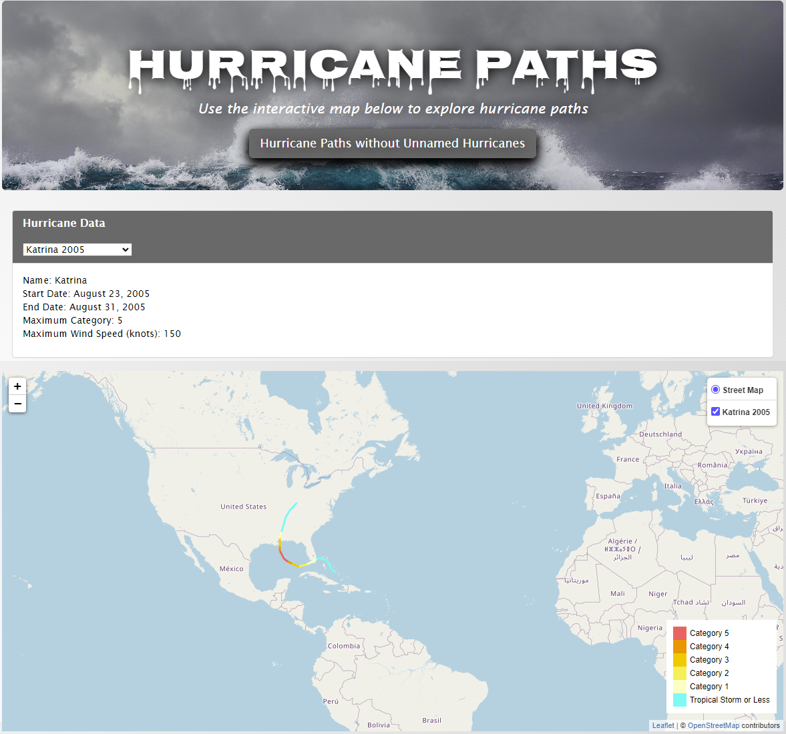

# Hurricane Path Mapper

## Description

This is a project that maps every hurricane with more than one data point from the [NOAA Atlantic hurricane database](https://www.nhc.noaa.gov/data/hurdat/hurdat2-1851-2021-041922.txt) from 1851-2021.

This is a further exploration of a group project I had, which can be found here: [Project 3](https://github.com/kringlek/Project-3).
The project was in collaboration with Anisha Chaudhari, Chuck McManus, Kasey Mathues, Kellimarie Cooper, Prathiba Shankar and Ryan Charlton.

I worked on mapping hurricane paths for the project and wanted to do it on a bigger scale. The project dealt with mapping 158 hurricanes where we had death totals and damage information. However, the [data source](https://www.nhc.noaa.gov/data/hurdat/hurdat2-1851-2021-041922.txt) for the paths has information on many more hurricanes. The final number of hurricanes mapped in this project is 1906 (once we remove any hurricanes that had just one data point).

## Screenshots
Below are screenshots of the final maps for hurricane Katrina (2005) and hurricane Sandy (2012):

  
   

## Usage

In order to reproduce the website, download the font [Nosifer-Regular](font/Nosifer-Regular.ttf). Also, in order to avoid errors in compilation, the html file has to be run through a live server.

## Data Cleaning

After downloading the original data, I used [VBA](Data/reformat.vbs) to reformat the excel document to make the data easier to work with in pandas. I then got the data ready for use in mapping using pandas in a [jupyter notebook](Hurricane_Path/Hurricane_Paths.ipynb). After cleaning the data, I created a dictionary with each hurricane as a key and outputed a [json file](static/js/hurricane_path.json) with the results.

## Mapping

Finally, I used JavaScript and leaflet to create maps of each hurricane path. Each path is color-coded to show the category of the hurricane at that coordinate.

## No Unnamed Version

I included within the folder [No_Unnamed](No_Unnamed) a version of the website without any of the unnamed hurricanes. In comparison to the version including unnamed hurricanes with 1,906 hurricanes, this version only has 822 hurricanes. This mainly impacts hurricanes before 1950, since the first named hurricane occurs in 1950.

## Future Work

The [NOAA database](https://www.nhc.noaa.gov/data/) also includes a Northeast and North Central Pacific hurricane database from 1949-2021. Future work could also include these hurricanes in the maps. The website includes many other visualizations and datasets, so future work could also utilize these in a website. I also hope to come up with a way to better organize the hurricanes with the selector tool.
