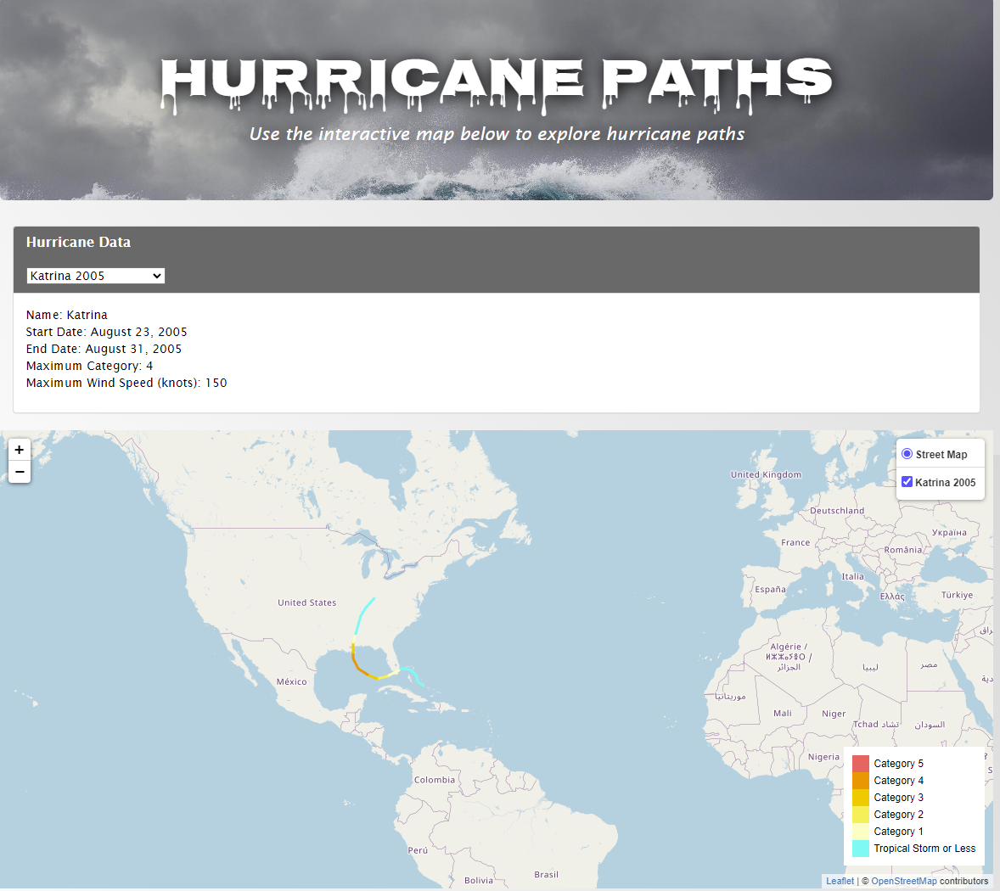
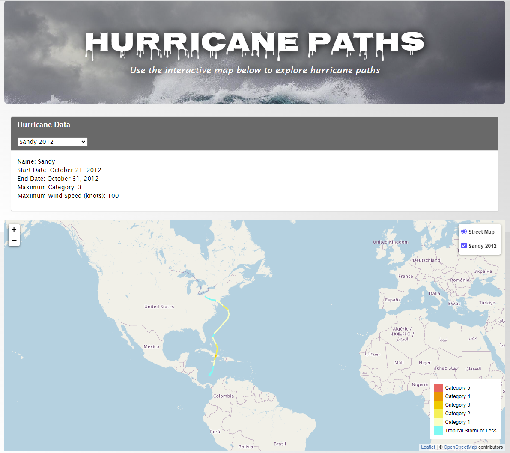

# Hurricane Path Mapper

## Description

This is a project that maps every hurricane with more than one data point from the [NOAA Atlantic hurricane database](https://www.nhc.noaa.gov/data/hurdat/hurdat2-1851-2021-041922.txt) from 1851-2021.

This is a further exploration of a group project I had, which can be found here: [Project 3](https://github.com/kringlek/Project-3).
The project was in collaboration with Anisha Chaudhari, Chuck McManus, Kasey Mathues, Kellimarie Cooper, Prathiba Shankar and Ryan Charlton.

I worked on mapping hurricane paths for the project and wanted to do it on a bigger scale. The project dealt with mapping 158 hurricanes where we had death totals and damage information. However, the [data source](https://www.nhc.noaa.gov/data/hurdat/hurdat2-1851-2021-041922.txt) for the paths has information on many more hurricanes. The final number of hurricanes mapped in this project is 1906 (once we remove any hurricanes that had just one data point).

## Screenshots
Below are screenshots of the final maps for hurricane Katrina (2005) and hurricane Sandy (2012):

  
   

